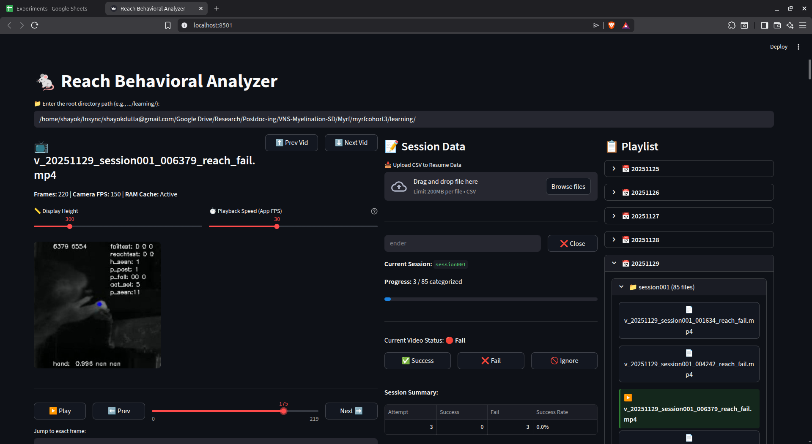

# 🐁 Reach Behavioral Analyzer

A sleek, browser-based frame-by-frame video analyzer and behavioral logging tool built with Python and Streamlit. 

This tool is designed to streamline the manual classification of animal behavioral tasks. It combines a robust video player with an integrated data-entry system, automatically groups videos by session, audits manual curation against automated neural network labels, and provides bulletproof data-saving features to prevent accidental data loss in the lab.

## ✨ Key Features
* **Modern Web Interface:** Replaces clunky desktop GUI frameworks with a responsive web app.
* **Frame-by-Frame Control:** Scrub through videos with absolute precision or play them at a controlled 10 FPS.
* **Smart Session Tracking:** Automatically detects when you switch to a new animal/session. If you have unsaved changes, it prevents data loss by halting the app and prompting you to save.
* **Automated Curation Auditing (Conflict Detection):** Automatically compares your manual label against the automated neural network label in the video's filename, flagging mismatches for easy auditing.
* **Live Editable Dataframes:** Fix classification mistakes on the fly by double-clicking directly inside the app's raw data table.
* **Seamless Session Resuming:** Upload a previously saved CSV to instantly restore your session's exact state and jump back to the first video.
* **Overwrite Protection:** Built-in safeguards prevent you from accidentally overwriting an existing animal's data file without explicit confirmation.

---

## 🛠️ Installation & Setup

**1. Clone the repository**
Ensure you have the main `app.py` script saved on your local machine.

**2. Install dependencies**
This app requires Python 3.8+ and a few external libraries. Open your terminal or Anaconda prompt and run:
`pip install streamlit opencv-python pandas`

**3. Run the application**
Navigate to the folder containing the script and run:
`streamlit run app.py`
A new tab will automatically open in your default web browser displaying the app. To shut down the app, go back to your terminal and press `Ctrl + C`.

---

## 📂 Required File Naming Convention

For the automatic session-tracking and conflict-detection to work, your video files **must** follow this naming convention:
`v_YYYYMMDD_sessionXXX_anything_else_automatedLabel.mp4`

**Examples:**
* `v_20251125_session001_012032_reach_fail.mp4`
* `v_20251125_session002_147848_stim_success.mp4`

The app splits the filename by underscores (`_`). It expects:
1. The **date** to be in the second position.
2. The **session ID** to be in the third position.
3. The **automated label** (e.g., `success` or `fail`) to be at the very end of the filename before the `.mp4` extension.

---

## 🚀 How to Use the Analyzer

### 1. Load Your Folder
At the top of the app, paste the absolute path to the directory containing your video files and press `Enter`. The playlist on the right will automatically populate.

### 2. Start or Resume a Session
* **New Session:** Click the first video in the playlist for your target session. In the middle **Session Data** column, type in the **Animal ID** (e.g., `Mouse_12`).
* **Resume Session:** Drag and drop a previously saved `.csv` file into the "Upload CSV to Resume Data" box. The app will automatically fill in the Animal ID, load your previous classifications, and jump to the first video.

### 3. Analyze and Classify
Use the video controls to analyze the behavior, then click one of the classification buttons:
* **✅ Success:** Logs a success and auto-advances to the next video.
* **❌ Fail:** Logs a failure and auto-advances.
* **🚫 Ignore:** Marks the video as a non-attempt and flags it as a conflict (does not add to the attempt total).

*Note: If you make a mistake, you can simply scroll down to the "Editable Raw Data" table and double-click the outcome cell to change it. The summary statistics and conflict flags will recalculate instantly.*

### 4. The "Conflict" Column (Data Auditing)
The software automatically audits your manual label against the filename's automated label:
* **`0` (Match):** Your manual label matches the neural network's label.
* **`1` (Conflict):** Your manual label disagrees with the neural network, or you marked the video as `Ignore`.

### 5. Saving Your Data
The app tracks whether you have unsaved modifications. 
* **Manual Export:** Click "Download Current Session to Save" at any time to download the CSV directly to your default downloads folder.
* **Smart Auto-Prompt:** When you finish a session and click a video belonging to a *new* session in the playlist, the app will freeze and prompt you to save the completed session directly to your video folder. If no changes were made since your last save, it will silently transition to the new session without interrupting your workflow.

---

## 📊 CSV Export Format

The exported CSV file contains a complete raw log followed by the session summary totals. It is fully compatible with Excel, R, Python, and the app's own resume feature:

| Video | Outcome | Conflict | Total_Attempts | Total_Success | Total_Fail | Success_Rate_% |
| :--- | :--- | :--- | :--- | :--- | :--- | :--- |
| v_20251125_session001_01_reach_fail.mp4 | Fail | 0 | 15 | 10 | 5 | 66.7 |
| v_20251125_session001_02_stim_success.mp4 | Fail | 1 | 15 | 10 | 5 | 66.7 |
| v_20251125_session001_03_reach_fail.mp4 | Ignore | 1 | 15 | 10 | 5 | 66.7 |