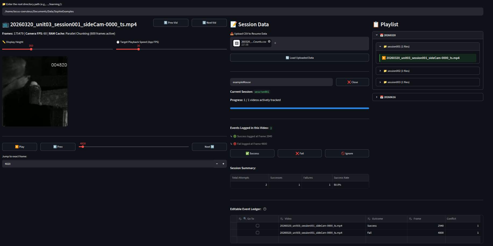

# 🐁 Reach Behavioral Analyzer



A high-performance, browser-based frame-by-frame video analyzer and behavioral logging tool built with Python and Streamlit. 

Optimized for high-speed camera data (e.g., 150+ FPS), this tool is designed to streamline the manual classification of animal reaching tasks. It utilizes parallelized multi-core RAM caching and image compression to provide lag-free video scrubbing directly in your web browser. It automatically scans your directories to build a collapsible date/session hierarchy, maintains a dynamic event ledger, and provides bulletproof data-saving features to prevent accidental data loss in the lab.

## 🔄 Evolution: From Clips to Continuous Sessions
**Originally**, this tool was built to handle pre-processed subsets of videos. It was designed to load and curate brief, 1.5-second behavioral clips (typically 219–225 frames per video at 150 FPS), classifying each short snippet as a single "Success" or "Failure."

**Now**, the Analyzer has been completely re-architected to handle **entire, unclipped recording sessions** (e.g., continuous 20+ minute videos). Because loading massive, high-framerate sessions directly into memory is impossible, the tool now features a background multi-threading engine that anticipates your playback and dynamically swaps 600-frame chunks into RAM. Furthermore, the curation logic has shifted from a rigid "one-video-to-one-outcome" model to an infinite **Event Ledger**, allowing you to continuously watch a long session and log dozens of independent reaching events on the fly. 

## ✨ Key Features
* **Parallelized Smart Chunking:** Bypasses slow hard-drive and memory limits by utilizing multi-core processing to decode, compress, and cache 600-frame rolling windows in the background, keeping your RAM footprint perfectly stable during 20-minute videos.
* **Delta-Time Playback Engine:** Natively reads your camera's capture rate and uses a real-time clock to ensure your chosen playback speed is perfectly accurate, gracefully dropping frames if the browser lags.
* **Dynamic Event Ledger:** Log multiple successes, failures, or ignores within a single uncropped video. The table automatically captures the exact frame number for each event.
* **Interactive "Go To" Navigation:** Click the 🔍 checkbox next to any logged event in your ledger to instantly pause the video and jump to that exact frame—even if the event occurred in a different video within the session.
* **Continuous Scrubbing Hotkeys:** A fully integrated, capture-phase JavaScript listener allows you to hold down the arrow keys for smooth, throttled fast-forwarding and rewinding without crashing the Streamlit websocket.
* **Smart Directory Scanning:** Point the app to a root folder (e.g., `learning/`) and it utilizes Regex to automatically map out all subfolders, building a clean, nested hierarchy of Dates ➡️ Sessions ➡️ Videos.
* **Workspace Protection:** Requires a valid Animal ID before allowing data exports to prevent anonymous logs, and provides safe-exit dialogs if you attempt to close a session with unsaved curations.

---

## ⌨️ Keyboard Shortcuts

The app features a silent background listener that intercepts keystrokes to maximize curation speed. *(Note: Hotkeys are automatically disabled while you are typing inside a text box).*

| Action | Key |
| :--- | :--- |
| **Play / Pause** | `Spacebar` |
| **Previous Frame** | `Left Arrow` *(Hold for continuous rewind)* |
| **Next Frame** | `Right Arrow` *(Hold for continuous fast-forward)* |
| **Previous Video** (in session) | `Up Arrow` |
| **Next Video** (in session) | `Down Arrow` |
| **Classify: Success** | `S` |
| **Classify: Fail** | `F` |
| **Classify: Ignore** | `I` |

---

## 🛠️ Installation & Setup

**1. Clone the repository**
Ensure you have the main `app.py` script saved on your local machine.

**2. Install dependencies**
This app requires Python 3.8+ and a few external libraries. *Note: Streamlit version 1.46.0 or higher is required for the nested date/session folders to display correctly.*
```bash
pip install --upgrade streamlit opencv-python pandas